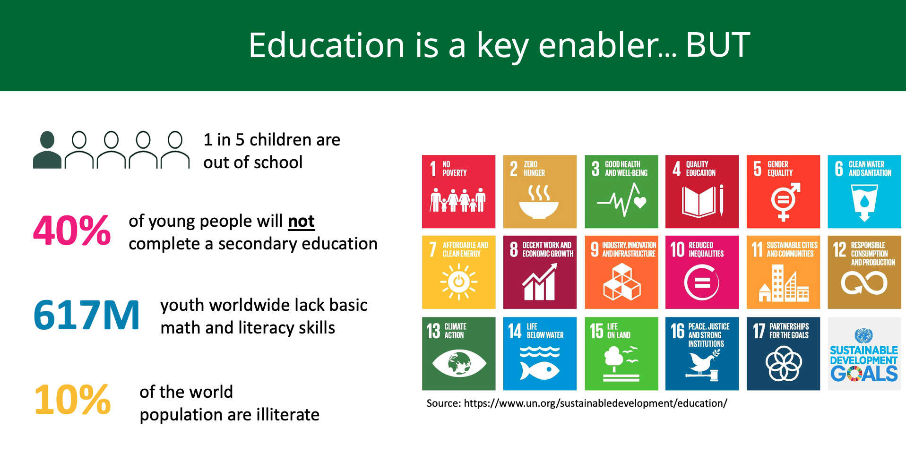
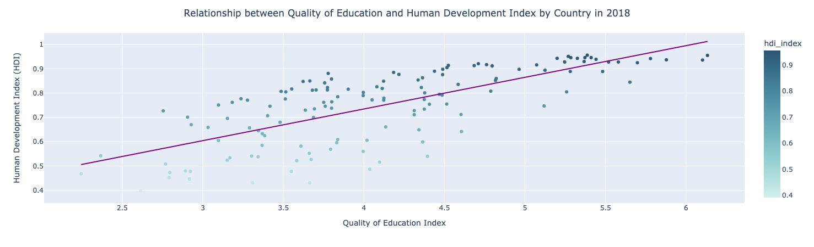
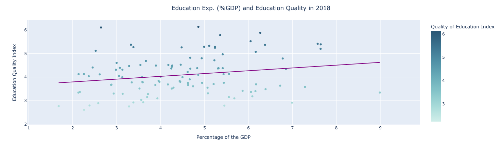
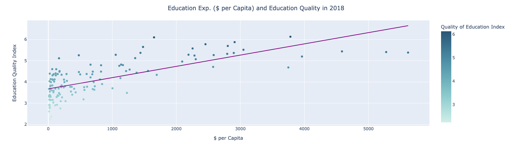
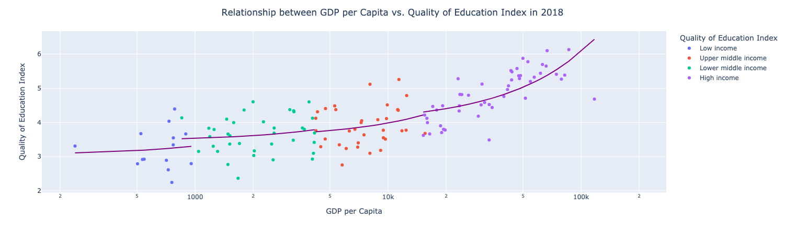

# Education Quality: A Socioeconomic Indicator?

## Motivation and Purpose

Education is a key enabler for the future and prosperity of societies. It is not only one of the main SDG but also the vast majority of the other SDG goals such as no poverty, no hunger, gender equality, industry and innovation can be tied back and fueled by a well-educated population. The SDG goals are goals defined by the countries of the united nations to ensure a sustainable and bright future for humanity. In that sense, there is a common understanding of how important education is for our future and prosperity, yet today

In 2021, Most recently the Nobel prize in economic sciences was awarded to 3 scientists for establishing a causal relationship between education and earnings. We believe that education has a far more reaching hand, and, in our analysis, we attempt to establish the correlation between the indicators of quality of education and the indicators of prosperity within the society.

Specifically, we are interested in exploring the following questions:

Q1. Does the increase in the quality of education improve social and economical welfare of people (HDI Index)?  
Q2. Does the education expenditure as a % of the GDP correlate with increase in quality of education?  
Q3. Does the increase in education expenditure per capita ($ per capita) result in an increase in the quality of education?  
Q4. Does the increase in the quality of education result in an increase in the living standards of the people (GDP)?

## Data Sources

In order to answer the questions proposed, we downloaded the 3 datasets cited below

- World Economic Forum. <i> The Global Competitive Index dataset 2007-2017</i>
- The World Bank, <i> DataBank, World Development Indicators</i> https://databank.worldbank.org/source/world-development-indicators
- United Nations Development Programme, <i>< Human Development Reports /i>. https://hdr.undp.org/en/indicators/137506

### Global Competitive Index dataset
  * Title: The Global Competitive Index dataset 2007-2017
  * URI: http://www3.weforum.org/docs/GCR2017-2018/GCI_Dataset_2007-2017.xlsx
  * Keywords: NA
  * Publication Date: February 26, 2018
  * Publisher: OECD
  * Creator: World Economic Forum
  * Contact Point: N/A
  * Spatial Coverage: Global
  * Temporal Coverage: 2017 - 2018
  * Language: English
  * Date & Time Formats: "DD/MM/YYYY"
  * Data Version: 20180712
  * Access Date: February 22, 2022

### DataBank, World Development Indicators
  * Title: World Development Indicators
  * URI: https://databank.worldbank.org/source/world-development-indicators
  * Keywords: NA
  * Publication Date: February 26, 2018
  * Publisher: The World Bank
  * Creator: The World Bank
  * Contact Point: N/A
  * Spatial Coverage: Global
  * Temporal Coverage: 2002 - 2021
  * Language: English, Español, Français, عربي, 中文
  * Date & Time Formats: "DD/MM/YYYY"
  * Data Version: 20180712
  * Access Date: February 22, 2022

### United Nations Development Programme, Human Development Reports
  * Title: Human Development Reports
  * URI: https://hdr.undp.org/en/indicators/137506
  * Keywords: NA
  * Publication Date: NA
  * Publisher: UNDP
  * Creator: UNDP
  * Contact Point: N/A
  * Spatial Coverage: Global
  * Temporal Coverage: 1990 - 2019
  * Language: English
  * Date & Time Formats: "YYYY"
  * Data Version: NA
  * Access Date: February 22, 2022

## Process
The following process has been applied to achieve our results:

- Data loading: data_cleaning
- Preprocessing: data_cleaning
- Imputation: data_cleaning
- Analysis of questions without imputed data: 02_analysis
- Analysis of question with imputed data: 02_analysis

Output from each step is written in files to be laoded in 

## Analysis

We ran the analysis on 2018 data which represented the latest full dataset.

Running the analysis without the missing data in the year 2018 and after imputing the data using G

### Question 1: Does the increase in the quality of education improve social and economical welfare of people (HDI Index)?

**At a Glance: Yes**. There seems to be a positive associated between Quality of Education and HDI. The R^2 of 0.53 suggests that as the quality of education increases, the socio-economic condition - as represented by the HDI -  also increases.

**Deep Dive:**

We see similar trends when we deep dive into our analysis by the income groups of countries. We see strong relationship in 'High Income' and 'Low Income' countries. The trend is weak in 'Middle' income countries. 

If we analyze the variables by geographic region, we again see strong positive relationship. This relationship is particularly strong in East Asia and Pacific as well as Europe and Central Asia.

Our deep dive confirms the overall conclusion.

### Question 2: Does the education expenditure as a % of the GDP correlate with increase in quality of education?

**At a Glance: No.** 
Based on the analysis performed, it is safe to say that _Education Expenditure as a % of the GDP_ **DOES NOT** have a strong relationship with _Quality of Education_. In other words, the change in the quality of education cannot be explained by change in educational. We see R^2 value of 0.06 which suggests this conclusion of a weak relationship. 

**Deep Dive:**

If we deep dive into the same relationship by Country Income Group, we still see low R^2 values for each income group. As a generic trend, we do see that on average countries with high income have a greater quality of education compared to the rest. We cannot say much about the trend line as its a weak relationship with high squared error.

If we see the target variables with respect to geographic region, apart from Africa, we start seeing some relationship.
All regions but Middle East & Africa have a positive relationship which suggests as we increase the spend on education as % of GDP, we see increased Quality of Education Index. The relationship is not very strong, which suggests that Spend on Education IS NOT the only factor impacting the quality of education.

### Question 3: Does the increase in education expenditure per capita ($ per capita) result in an increase in the quality of education?

**At a Glance: Yes.** 

There's an association (R^2 0.5) between the education expenditure per capita in USD and the the increase in quality of education.

Looking at this analysis we can see that there is a quite good correlation between the amount of spend per individual and the quality of education. So it is quite likely that when we increase the spending per individual we would see and increase in the education quality.

However, we also notice that when the spending is less than $2000 per capita we get a very high variation in the quality of education. Beyond that point, the increase more in education quality levels off but we achieve consistent result with less variation among the results. This again emphasizes the inequality in education since wealthier countries can afford to spend more on education and hence ensure that they get consistent quality in the education.

### Question 4: Does the increase in quality of education result in an increase in the living standards of the people (GDP per Capita)?

**At a Glance: Yes**. 

55% of the increase in GDP per Capita (or living standards of citizen) can be explained by their Quality fo Education. However, things become really interesting when we look at this the other way around.

There's very weak association between the GDP per capita (GDPPC) and the quality of education among very low income groups. However, once the GDPPC exceeds a certain threshold (USD 10K), the education quality increases dramatically and the association become a lot stronger

## Conclusion

While we started our analysis seeking to examine the relationship between the quality of education and the socio-economic welfare, we stumbled upon much more important observations. Yes there's a positive relationship between the quality of education and the socio-economic welfare as analyzed using the education quality index and human development index. Accordingly, countries should invest in improving the quality of the education of their nations. 

However, while some might think that increasing the budget that the country puts in the education would result in an improvement in the quality of education, it is not that straight forward. High income countries increasing the percentage of the budget was correlated with an increase in the quality of education but for the rest of the income groups there was no association between the percentage of the GDP spent on the education and the quality. This suggests that there are other influencing factors that needs to be dealt with first before committing further investments that might go to waste.

The broader point that we discoverd during our analysis is that the economic divide in the world continues to feed the vicious cycle of inequality. The rich, developed and high income countries continue to reap benefits of their investments and get better returns, while the rest of the income groups have the odds stacked against them.

## Contributors

- Syed Arsalan Raza
- Christine David
- Parul Metha

## Reproduction Steps

Each notebook lists the libraries used in the beginning of the notebook

Modules used:

- numpy 1.21.2
- openpyxl 3.0.9
- pandas 1.3.5
- klib 1.0.1
- plotly 5.1.0
- statsmodel 0.13.0
- miceforest 5.1.2